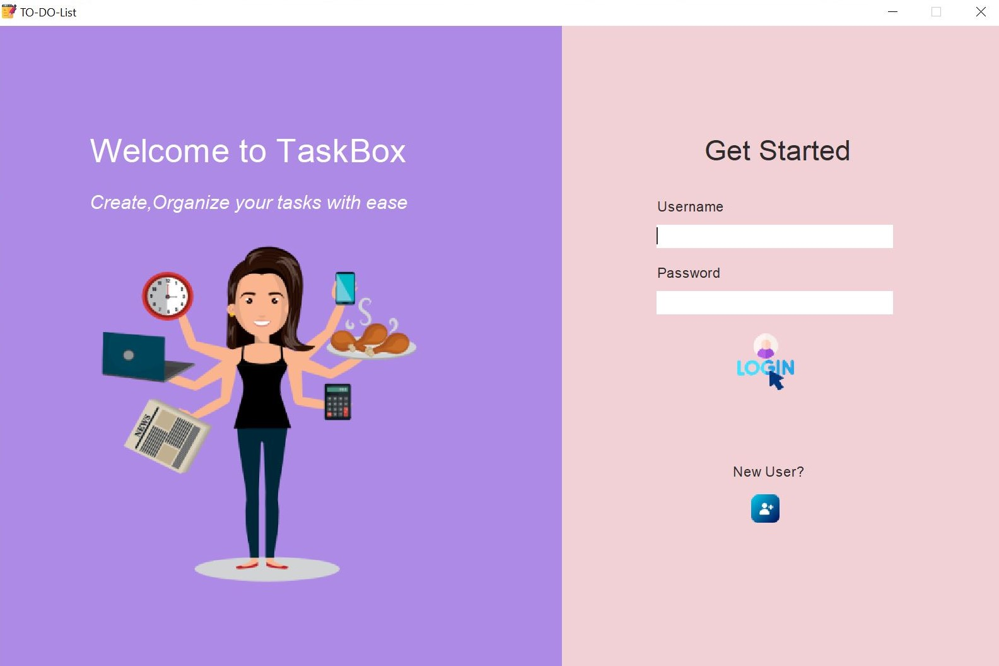
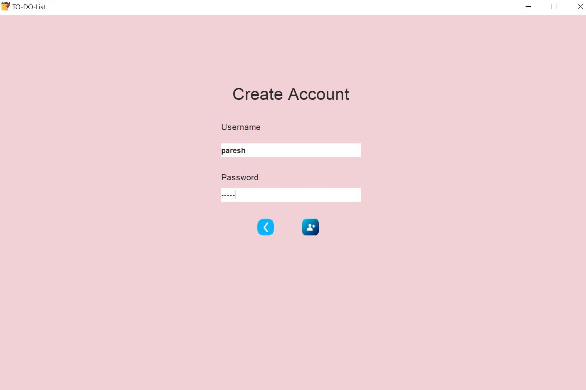
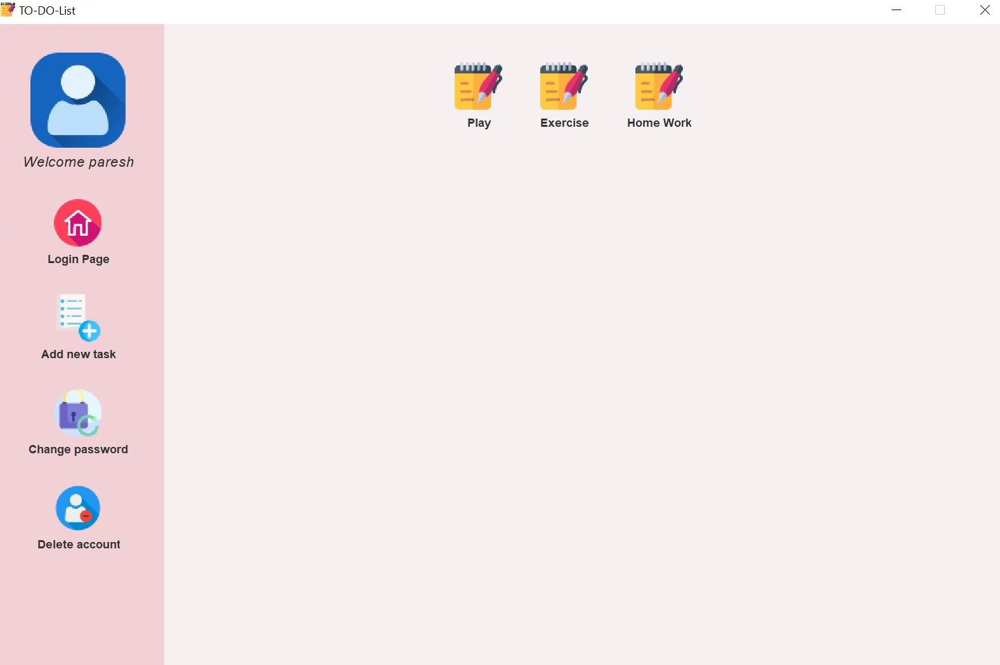

# TaskBox a To-do list app in Java with MySQL

A To-Do List app using java. User can create account, login, add tasks, change or delete tasks, change password and delete account.

## Required Packages
* Swing (GUI widget toolkit for Java)

## IDE Used
* IntelliJ IDEA

## How to run
```
Run Main.java in your IDE.
```
In Linux
```
javac Main.java
```
## Images

* Login page



* Register



* View and add Task


