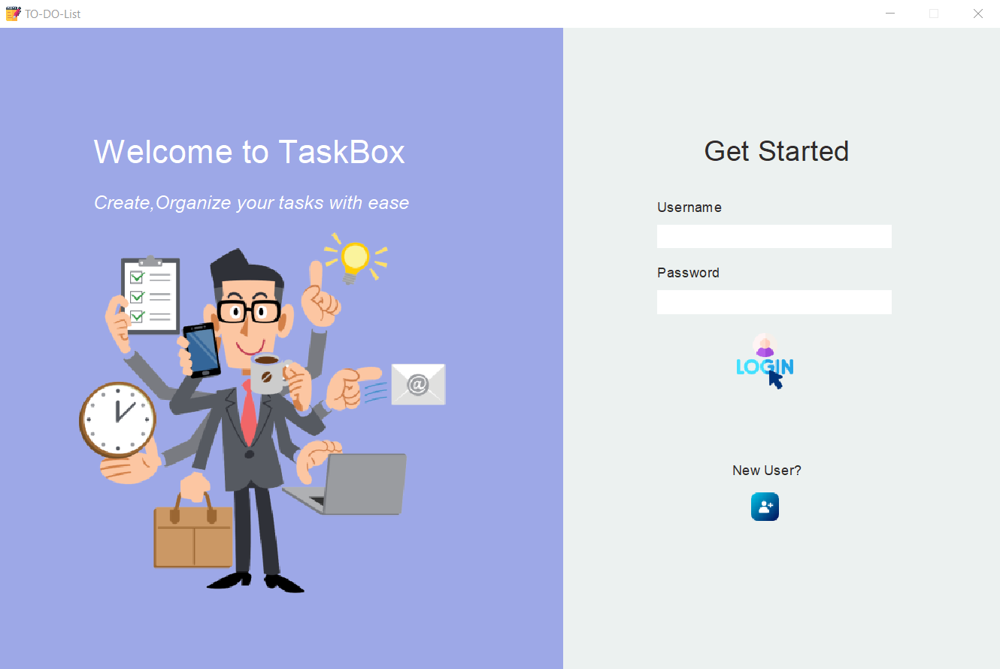
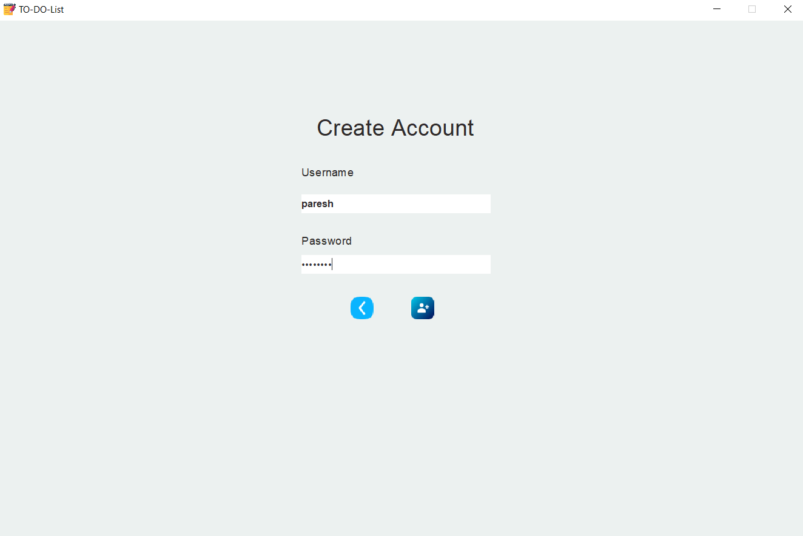
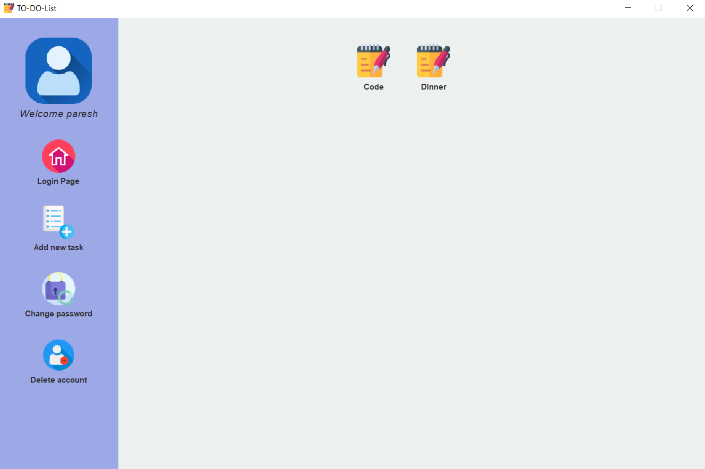

# To-do list app in Java with JDBC

A To-Do List app using java. User can create account, login, add tasks, change or delete tasks, change password and delete account. It connects to app database (MySQL) with JDBC (Java Database Connectivity) through the Java code. JDBC is one of the standard APIs for database connectivity, using it we can easily run our query, statement, and also fetch data from the database. I have used Swing (GUI widget toolkit for Java) for this app.

## Requirements
* JDK
* MySQL
* MySQL Connector to the Java (JAR file), the ‘JAR’ file must be in classpath while compiling and running the code of JDBC

## IDE Used
* IntelliJ IDEA

## How to run

### Ubuntu

```
* Install mysql-server : sudo apt-get install mysql-server
* first export the jar file - export CLASSPATH="/path/to/file":${CLASSPATH}
* In Main.java. Change mysql_username and mysql_password to your url, username and password.
* Compile - javac Main.java
* Run - java Main
```

* You dont need to create any database or tables as database and tables will created by app. But if you want to create initial user_info tables to fill some values follow this steps:

```
* Start mysql : sudo mysql -u root -p ( password - root)
* To create database : CREATE DATABASE to_do_list_app;
* Connect to database : connect to_do_list_app;
* Create user_info table : CREATE TABLE user_info( user_id varchar(20), user_password varchar(20), PRIMARY KEY (user_id));
* Now that table is created, you can fill some values which you want initially using mySQL commands.Same can also be done by using GUI.
```
If you are using IDE, add jar file to your project (included in lib directory).

## Images

* Login page



* Register



* View and add Task


